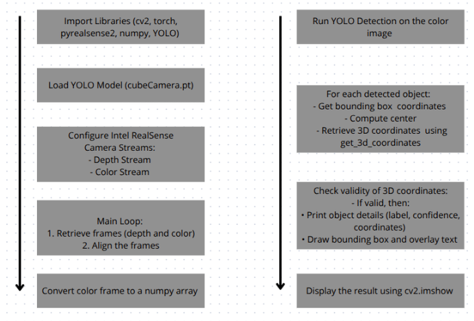
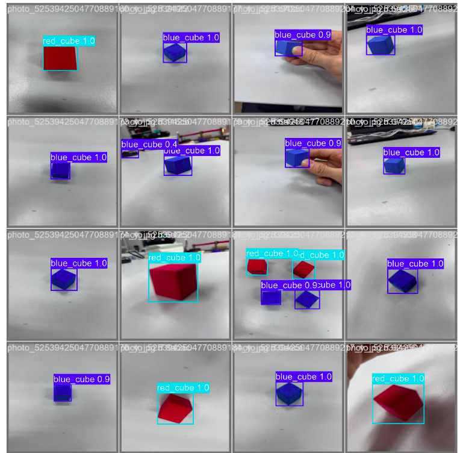
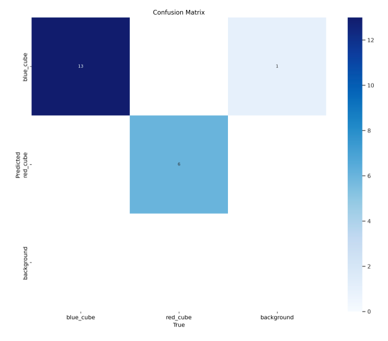
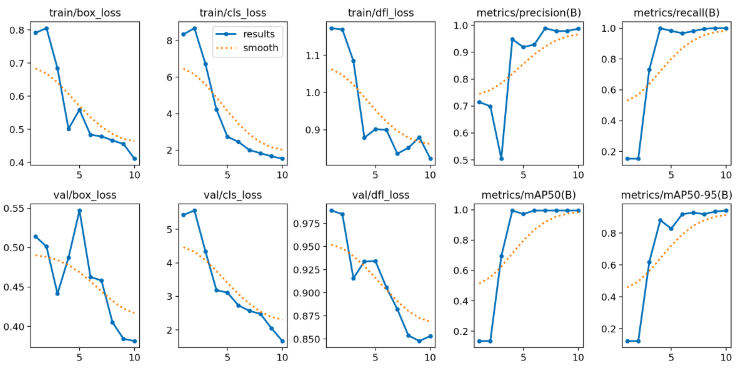

# ComputerVision-Python 👁️🤖

This repository is my personal workspace for **computer vision experiments in Python**:testing libraries,trying different approaches,and training CV models for real-world tasks.

✅ **Main project:**Real-time **3D cube detection + (x,y,z) coordinate extraction** using an **Intel RealSense depth camera** and a **YOLO-based detector**.  
Main script: **`realsense_camera_002`**

---

## 🎥 Demo (real video)

Click to watch the live detection + 3D coordinates demo:

---

## ⭐ Main Project:3D Cube Detection + 3D Coordinates (x,y,z)

### What it does
- Captures **color + depth** streams from Intel RealSense
- Runs **YOLO object detection** on the color frame (blue_cube/red_cube)
- Takes each detection’s 2D center pixel and uses depth to compute **3D coordinates (x,y,z)**
- Draws bounding boxes + labels + coordinates in real time

### Why it matters
This workflow is directly useful for:
- robotics pick-and-place
- spatial perception for autonomous systems
- AR/VR depth-aware overlays
- measurement and tracking tasks

---

## 🔧 Integration Skills Demonstrated

- **Intel RealSense integration:** OpenCV + `pyrealsense2` for color/depth streaming  
- **Real-time processing:** frame capture + alignment of depth-to-color for correct spatial mapping  
- **Object detection:** loading and running a YOLO model live,and parsing detections  
- **3D coordinate extraction:** 2D → 3D conversion using depth information  
- **Validation & error handling:** safe checks when depth is missing/invalid  
- **Visualization:** overlaying boxes,labels,confidence,and XYZ coordinates for clear feedback

---

## 🧠 How the pipeline works (high level)

1. Import libraries (OpenCV,PyTorch/YOLO,pyrealsense2,NumPy)
2. Load YOLO weights (example:`cubeCamera.pt`)
3. Start RealSense streams (color + depth)
4. Main loop:
   - read frames
   - align depth ↔ color
   - run YOLO on the color frame
   - for each detection:
     - get bbox + center
     - compute 3D (x,y,z) using depth
     - validate coordinates
     - draw results
5. Display output (OpenCV window)

---

## 📊 Training & Results (included in repo)

This repository also contains training artifacts/visuals such as:
- detection examples (bounding boxes on cubes)
- confusion matrix
- training curves (loss,precision/recall,mAP)

---
## 📷 Results & Visuals

<table>
  <tr>
    <td></td>
    <td></td>
  </tr>
  <tr>
    <td></td>
    <td></td>
  </tr>
</table>

---

## 🛠 Tech Stack

- Python
- OpenCV
- PyTorch / YOLO
- Intel RealSense (`pyrealsense2`)
- NumPy

---

## 🚀 Quick Start (typical setup)

### Requirements
- Intel RealSense camera (e.g.,D435/D455)
- RealSense SDK installed
- Python environment with the needed packages

### Install dependencies
If you have a `requirements.txt`:
pip install -r requirements.txt

---

### 📁 Repository Notes

Besides the main RealSense project,this repo includes many smaller scripts created during learning and experimentation (different CV ideas,tests,and training attempts).Some folders/files may be prototypes or intermediate versions.

### 👤 Author

- **Developed** by Rassul Zeynulla
- **Focus:** Computer Vision,Robotics,Real-Time Perception
